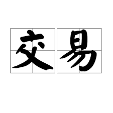

## 文章标题

最近因为搜索相亲的缘故，B站的个性化推荐提到了一个up主。

她是一个比较成熟的女性，是情感博主，账号的定位非常明确，就是向“小仙女”们提出她的一些中肯的建议，希望她们不要活的在幻想当中。

当然她的逻辑一定没有这么严密，也没有海量的数据支撑，毕竟她的视频还是面向大众的嘛。

**当中一个核心思想我需要总结一下，因为你会发现许多up都是有明确的定位的，然后她们的许多视频也许就是换汤不换药的。**

当然不否认有一部分大的博主信息密度特别高，每期内容主题都不太相同，这类博主背后大概率就是有一个团队了，所以说大部分普通个人博主是做不多这个水平的。

她的视频的核心就是一个，希望那些年轻的姑娘们，如果未来是有结婚的打算的，早点“上岸”。

这个思想我是认同的，不是说我看到了她的视频才恍然大悟，突然觉得自己思想受到的升华，不是的 。

是我本来就有这样一个答案，只不过刚好找到一个up可以印证我的思想而已。以下是正文。

## 01

这里面的问题就比较复杂了，首先说到婚姻吧，为什么我们需要婚姻？具体一点，为什么女人需要有一段婚姻？

那位up的解释是，女人不结婚的话，就是和这个世界当中的所有人竞争生存资料；但是如果女人结婚的话，那就是只需要和其他女人竞争男性就可以了。

大致是这个意思，我不是完全赞同她的意见，但是认为其中的一些思想有些合理之处。首先，前半部分我基本认同，后半部分我认为需要补充。

我认为女人在结婚之后，依然需要保持竞争状态，只不过在结婚之前，她需要在社会中众多的优质男生中竞争到自己满意的对象。结婚之后，她需要和其他觊觎自己男人的女人竞争，把男人和家庭紧紧的把握在自己的掌握之中。

有句话说得好：结婚不是领证的那一天，是领证之后的每一天。

结婚之后女人需要怎么把男人绑定？她需要和男人有共同的利益，她自己也需要有价值，其中一个重要的部分就是她要有自己的事业。虽然在婚姻当中，男方经济上趋向于优势，但是女人要有离开男人自己生活的能力和事业，这也是保持婚姻稳定的重要因素。

不然，主动权就不在自己身上了，婚姻中会处于被动状态。你的竞争者很容易抓住你丈夫的心。

首先，如果一个女人不婚不育的话，那么她其实在这个社会看来，就和男人没有区别。这一点可以理解，因为这个社会尊重妇女孕妇，有一个非常重要的依据就是，未来祖国的花朵需要她们。

这就涉及到许多问题，比如说彩礼为什么会存在？女人在婚姻中失去了什么？婚姻是她们的尽头吗？这里不展开。

好，如果你也这么认为的话，那我们可以继续分析下去，如果女人不结婚，她充当的是男人的角色：在社会分工中充分竞争，通过自己的能力在职业中获取到自己的生存资料，此时性别不重要了，而且在当下的生产力条件下，女性对于体力的要求会相较于古代低很多。

这对女性来说是好事，这就是为什么生产力发展之后，女性的话语权越来越多了。

但是不可否认的是，在社会当中的很多行业，依然离不开体力要求。即使是一名白领也好，在社会分工中，依旧免不了是一个精密的螺丝钉的角色。

这就意味着，即使是脑力劳动，面对高强度的加班，密集的工作量，体力依然是不可或缺的要求之一。

那为什么男生选择相比女生要少很多呢？要注意这个点，男生在社会分工中之所以要和所有人竞争，不是他们想这样。而是他们不得不这样，自己的职业是一名男性的唯一可以依靠的。

当下社会看到富豪和小仙女一起的挺多的，如果说有富婆和小年轻一起，这种案例还是相对比较少的吧。

这里我没有大量的数据来支持这个结论，只不过是当下看到的情况而已。

毕竟也没什么官方来提供这种数据吧，但是这只是我观察下来的一般情况而已。既然这种现象普遍存在，那即使我们无法深入剖析为什么会发生这种情况。

但是可以把这种情况当做结论和公式套用。既然男生被富婆包养的情况非常少，那么男生还能靠什么呢？只能是自己的职业。

也就是说，男生只有一条路，也就是职业道路。女生有两条路，一条是婚姻道路，一条是纯粹的职业道路。

## 02

对女生来说，这两条道路不是矛盾的，踏入婚姻之后依然需要有自己的职业，但是一个很重要的点就是，踏入婚姻之后，女性对于自己的职业要求会相对更低一些。

这本身就是一个取舍的过程。

在企业看来，一个女生和一个男生，如果条件类似，一定会选择男生。因为男生没有产假，男生更稳定。女生踏入婚姻之后就不同了，不稳定不说，哺乳期还需要放假，不符合企业要求呀。

企业是需要盈利的，老板本身在市场竞争下面要争取到市场份额的时候是替下面的员工承担着风险的，总不能养着“闲人”吧。

所以女性在职业道路上，势必是趋于劣势的，为什么要说这个呢？这也就意味着女性如果走纯粹的职业道路，同等条件下是不如男性的。

在看看女性走婚姻路线，有一个公认的点，就是相亲和恋爱过程中， 金钱上一定是男方多付出一些的。其实婚姻中也是如此，这里就不赘述。

这里就有一个插曲，为什么存在彩礼这种社会现象？存在一定有其存在的原因的，其本身一定是符合当前社会发展的规律的。把女方和男方的利益当做一个黑盒好了，我们不需要考虑这个黑盒内部是怎么运作的，就看婚姻的时候，男方经济上承担的需要比女方多得多。

这就意味着什么呢？婚姻对于女方的利益黑盒来说，相比于男方的利益黑盒来说，是亏损的状态呀。

亏损的生意女方当然不愿意呀，所以聪明的古人就发明出彩礼，来应对女方在婚姻过程中的亏损。这种现象一直存在到当下，彩礼依旧存在，说明上述结论依旧成立。

这里就让我意识到一个点，就是成都重庆，西南地区的城市，结婚男方彩礼非常低，而江西彩礼非常高，就可以看出了，成都女方结婚亏损较小（女性家庭地位更高），但是江西，男方各方面条件的不足还有女性的婚姻劣势倒逼着彩礼水涨船高，来作为弥补。

所以小红书XXN说自己结婚吃亏了呀，希望男方多付出这类话，最终是要落地到哪个地方呢？

不就是生意中的讨价还价吗？通过向男方提出自己的要求，还有自己婚姻中的亏损，来迫使男方让出更多利益，这才是目的。

不可否认，女性在踏入婚姻之后，无论是生育方面，抚养方面，职业发展方面确实是吃亏的。所以说，她们不得不在婚姻这个节点上要求男方让渡利益。

分析到这里，我们回顾一下，就是女性在职业发展中，因为性别的缘故，已经是出于劣势状态。因为除了走纯粹的职业发展，女性还有走婚姻这一条道路，不同女性关于婚姻的看法是不同的。

如果女性想要走纯粹的职业道路，这就意味着她不需要考虑婚姻了，或者说她在婚姻中就处在男性的位置了。

如果女性不走纯粹的职业道路，就意味着她需要尽可能在婚姻选择中取得足够多的利益。就是让自己这个股票在最高点的时候抛售，狠狠的赚一笔。

那么下面需要讨论的就是，如果女性选择了婚姻的道路，那么如果使得自己在股票最高点抛售，争取在婚姻中获取到更多利益呢？

## 03

我们知道，婚姻本质上是一种交换，对于平民玩家来说，也就是家庭都是普通家庭，不存在联姻的情况下，那么男女双方本身就是很重要的变量。如果家庭背景不同，那么就需要考虑家庭背后的利益。

这里就好比《平凡的世界》当中，顾养民想要娶郝红梅，顾养民家里是干部家庭，郝红梅是地主成分，即使顾养民同意，他的父母，他的家庭会同意吗？一定不会呀，即使没有翻出来郝红梅曾经偷过商店手帕的历史，相信他们最终还是走不到婚姻那一步的。

不然为什么书名叫平凡的世界呀？/苦笑

现在只讨论双方家庭都是普通家庭，不存在家庭背景差距过大的情况。

如果女方想要从男方身上获取到更多，那么就需要搞清楚，男方对于女方的诉求和需求是什么？如果把男方比作企业的用人单位，女方比作应聘者的话。女方想要在市场竞争当中取得相比于其他女生的优势的话，就需要根据企业的需求打磨自己的简历和技能才对把。

婚姻也是如此，所以这就涉及到女方应聘的是哪一家企业了。我们知道不同企业的需求是不同的，而我们在就业的时候，不会只瞄准一家企业的特殊要求，而是找到市面上的企业的要求的最大公约数去努力，然后海投简历，增加自己上岸的概率。

婚姻也不例外，不过是找到市场上男生的普遍要求和需求，然后针对男方需求打磨女方的优势和特点，争取拿到更好背景，更好家庭的男方的offer。

其实男方的需求是什么？我自己也不知道，因为我只是一个个体，也没法代表当下市面上的男方的普遍情况。

不过我知道男生不需要什么，话题回到文章开篇提到的那位up主，她提到了一个粉丝的咨询案例，这个粉丝提到自己的特长的时候，说自己喜欢绘画，旅游，看电影，摄影，插画等等。我听到这些爱好之后人麻了，这些特长总结下来就两个字：花钱。

那花钱能作为自己的特长写在简历上吗？当然不行呀，男方看到这些东西吓都吓死了，最后不还是要男方买单吗？所以这些根本不够作为优势。

还有一点，也是我切身感觉到的，就是图书馆也好，教室也好，如果旁边的女生打扮的特别fashion，特别时髦和名贵，对我个人来说其实是能直接的感受到这个女生的消费观念的。

虽然我是个路人啊，也没规定说女生不能这么打扮，只是还是从企业招聘的角度来看，看到这个员工的高昂工资和待遇要求，大部分普通企业的反映就是，他们这座小庙容不下这座大佛。

不排除这类女生的定位本身就不是普通男性，他们的定位是高端且家里有矿的优质男性。但是，这样的男生也只是少数，我们只讨论一般情况。毕竟也不是很多男生都家里有矿吧。

所以，女生在打扮和穿搭上太过于“高级”，会给许多男生一种无法驾驭的感觉，隐形中减少了许多选择，这样是不合理的。

我个人来讲的话，女生打扮的简单一点朴素一点就可以了，特别是干净整洁。每次我在图书馆看到女孩特别丝滑的头发，都好奇她们用的什么洗发水，她们的飘柔的秀发总是能吸引我的注意力。

不知道其他男生这么想的，抽样调查我的室友，他说他不喜欢妆的太浓的女生。当然这里，只是个别男生的要求，不代表其他人。

那一般男生的需求是什么？有几个答案是确定的，这个一定是没问题的，就是女生会做饭，会做家务，这个一定是加分项。

还有一个也是确定的，就是“性”，不过都到谈婚论嫁的年级之后，这些只要是正常人一般都能够满足把，当然还有一些私密的要求，这些因人而异了，不好评价了。

最后一个一定是确定的，这个也是权重占很大的一部分，就是女生的年龄，颜值，身高，体重，身材。这个不用调查，一定是的，身边的每一个男性朋友都体现出来对于这方面的要求。

相信这方面无关性别，男女生都差不多吧。

我还年轻，如果还有其他的就不知道了，只不过前面的部分只是简单的逻辑推演和经验论而已。

女生可以加到简历上的是什么？做饭做家务，这点一定是可以的，还有的就是颜值了。注意哦，女生的颜值是有保质期的，即使一个女人到35岁，依然保养的不错，皮肤看上去像25岁。那从年轻男生的角度，他们为什么要找一个35岁的“小仙女”，而不是找一个25岁的“小仙女”呢？

记住一句话：没有人永远年轻，但是永远有人年轻。

这就是女生需要把握的点了，就是年轻和美貌。这两点就是女生在男生面前的很重要的点了，也是女生主动可以把握的点。

最后依然是落到一个结论上，女生早点结婚上岸性价比更高。前提是，女生有结婚的打算而不是走纯粹职业路线。

在现在2025年，这个结论对于2000-2003年的女生比较有指导意义吧，对于90后的女生该上岸的也已经上岸了，不上岸的后悔也来不及了，还没上岸的股票已经回不去之前的最高点了，只能即使止损了。

这些道理依然可以用于职业规划，本质上是价值交换。

