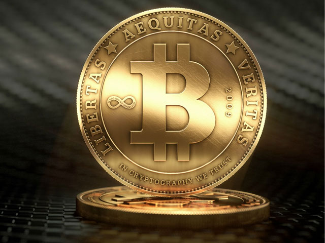

## 01

首先，简单说明一下昨天我探索的一些事情，昨天我在地铁上突然想到，碧树西风的投资领域是高频量化交易这一块，据他所说他的领域是投资圈比较高端的，就是说他精通这个圈子之后，俯视房地产圈等等领域是属于降维打击式的，然后基础逻辑都是共通的。

所以说，我昨天哔哩哔哩搜索了量化交易，里面介绍了几个平台，这些平台式使用Python代码编写交易逻辑，然后实现自动化交易的，里面有盈亏比的概念。看到这里我就知道，如果走过门槛的话，就已经和散户的思维不同了，这里真的是需要“跑数据”，做实践的，而不是单纯的毛想想。

这个领域一定是涉猎的人不多的，所以视频的播放量不高，而且资料比较少。

不满足于这些的我打开了咸鱼，搜索量化交易，看到一个软件里面是专门做这些的。我花了“一块钱”买了这个软件和资料之后，我就下载了这个.apk文件，然后开始了探索这个软件的内容。

让我比较惊讶的是，这个卖家在发货之后居然要求加我QQ，想要发给我这个软件关于新手的教程。所以我收到教程之后，我就大概浏览了一下里面的术语，还有探索了软件当中的充值渠道。让我非常惊讶的是，这个充值的渠道居然不是常规渠道，而是加密货币充值。

充值渠道会告诉你一个编码，我搜索了Deepseek之后，发现这个编码居然是泰达币的充值。于是回去的地铁上，一路我就在搜索泰达币到底是一个什么加密货币。

## 02

和比特币类似，泰达币也是一种加密货币，只不过这种货币的价值和美元是一比一的关系，于是今天我又一次打开了B站，搜索这种加密货币，发现居然里面的陷阱很多。

首先第一点就是，这个货币是法律不禁止，也不保护的一个灰色领域。可以理解，如果不保护的话，在涉足这个领域的时候调整好心态就可以了。

继续看评论，会不会涉及到违法，这是最重要的一部分。评论区大概有两种说法， 一种就是可能会违法，如果你把泰达币用人民币提现的话。警察可以给你下的罪名是帮信罪。因为你这样得到的钱有可能被洗钱洗过了，不是干净的钱，有可能是什么赌博软件里面的钱。还有一个评论就是警察可能会远洋捕捞，对于这些行为。还有一种评论就是这个法律警察是不管的，当然还有待考究。继续探索吧。

我今天地铁到达郫都区，下地铁的时候，继续看手机，发现昨天加了QQ的那个卖家居然主动问我，那个软件探索的怎么样了。这个属实把我吓了一跳，然后我花一块钱买那个东西真的不是为了赚钱，其实是买学习资料，然后一个一个去搜索那些专业术语的目的。而且一般来讲，咸鱼上一块钱卖资料的服务，本来就应该是发给你一个下载链接，你自己去下载资料，如果说卖家加上你，并且主动询问你，那么这个服务就不是这个价格了。

所以说，这个加重了我对他发给我的软件的怀疑程度，要知道那个软件当中的排行榜，谁谁谁赚了多少钱，首先是可以伪造的，然后他主动问我探索的怎么样了，充没充这些，说明他赚的是其他的钱，其中就有可能就是当事人所谓“投资”的本金。

所以我看到他主动给我发这些信息的时候，我立马就机警起来了，那个软件我也一定不会用，因为我学不会，充值渠道都是加密货币，我都没涉猎过这些，而且即使我把加密货币充进去了，能不能赚到钱是一回事，能不能提现是一回事，即使提现出来了，这个钱是不是黑钱也是不知道的，会不会被警察盖上一个帮信罪，那就麻烦大了。

所以说，在水这么深的领域当中，里面你真正可以安全的赚到钱的概率几乎为零。我相信，真正这方面虚拟货币的高手，也不会在咸鱼上找到他了，人家早就有自己盈利的体系了。

不过，这一块钱作为我的学费，那还是挺值的。其实我涉猎这个领域的目的，不是为了发财，因为人赚不到认知之外的钱，即使偶然赚到了，也会凭借自己的本事亏出去。而是为了了解这里面的一些东西，在未来自己有积蓄的时候，可以跑赢贬值的速度，这就超过许多人了。

据说是，年利率达到百分之10就足够了，其实圆方当年公众号里面说的合理配置资产可以达到百分之6以上，我当时看到觉得挺惊讶的，当然评论区也是这个表达的，但是圆方说的一些途径我看不懂，这就是我需要探索的地方。当你处理财富的能力达到这个水平之后，其实你可以把握的“钱”就有一个下限了，就可以保持正增长了。

如果想要搏一搏单车变摩托，我并不觉得这是我这个普通人可以做到的，即使偶然做到了因为因为你的策略再输回去。

## 03

反正到目前为止，我已经看到太多凭本事亏出去的钱了，但是拼本事在资本主义市场上赚到钱的，还屈指可数，我还无法解释他们“凭什么”赚到钱，而且我只是在一些群聊当中看到的他们（大佬），和他们没有任何联系。

不多说了，我继续高强度的网上冲浪了。搜索虚拟货币和量化投资这些名词到底是什么。